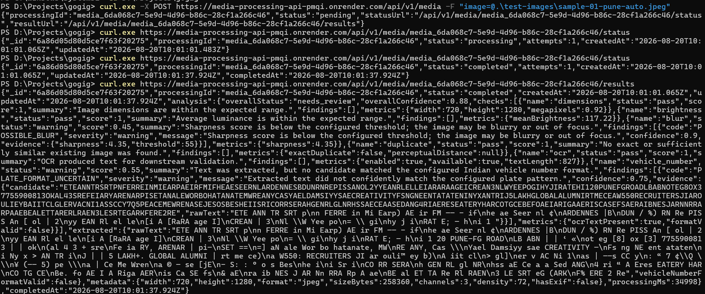
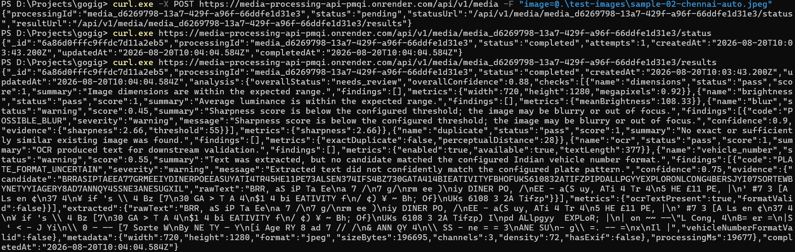
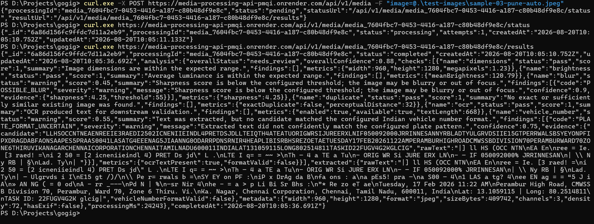

# Intelligent Media Processing Pipeline

Backend + AI engineering take-home assignment implementation for asynchronous vehicle-image processing.

## Live Deployment

**API Base URL:** `https://media-processing-api-pmqi.onrender.com`

**Health Check:** `https://media-processing-api-pmqi.onrender.com/health`

> The deployed free-tier setup runs the API and BullMQ worker in the same Render service. The processing remains asynchronous through Redis/Valkey. In production, the API and worker would be deployed as separate independently scalable services.

### Deployment Note

For the live free-tier deployment, the Express API and BullMQ worker run inside a single Render service because the free plan limits the number of services available for this submission. The worker still consumes jobs asynchronously through Redis/Valkey.

Uploaded images are stored in MongoDB GridFS rather than local disk so the storage layer remains shared and durable across processing stages. In a production deployment, the API and worker would be separated into independent services and object storage such as S3/GCS would be preferred.

## What this demonstrates

The service accepts an image, persists upload metadata, immediately returns a processing ID, and performs analysis asynchronously through Redis + BullMQ. The worker runs explainable image-quality checks and OCR, persists structured results, and exposes separate status/results APIs.

### Implemented checks

1. **Dimension validation** – rejects the assumption that any image resolution is equally useful for OCR/vehicle review.
2. **Brightness analysis** – flags very dark or overexposed images using pixel statistics.
3. **Blur detection** – uses Sharp's Laplacian-based sharpness statistic as a practical blur heuristic.
4. **Exact duplicate detection** – compares SHA-256 hashes.
5. **Near-duplicate detection** – compares a simple perceptual hash with Hamming distance.
6. **OCR extraction** – Tesseract.js extracts text from the image asynchronously in the worker.
7. **Indian vehicle-number format validation** – validates an OCR candidate against a deliberately conservative pattern. It is explicitly treated as a heuristic, not ground truth.
8. **Image metadata capture** – stores format, dimensions, size, channels, density and EXIF presence.

The system reports uncertainty through `status`, `score`, `confidence`, `findings`, and `evidence` instead of pretending every detector is binary truth.

## Architecture

```text
                    ┌─────────────────────┐
                    │       Client        │
                    └──────────┬──────────┘
                               │ multipart/form-data
                               ▼
                    ┌─────────────────────┐
                    │ Express API         │
                    │ POST /media         │
                    └──────────┬──────────┘
                               │
                  persist      │ enqueue
                               ▼
              ┌────────────────┴────────────────┐
              │                                 │
              ▼                                 ▼
     ┌─────────────────┐               ┌─────────────────┐
     │ MongoDB         │               │ Redis / BullMQ  │
     │ media record    │               │ analysis queue  │
     └─────────────────┘               └────────┬────────┘
                                                 │
                                                 ▼
                                      ┌────────────────────┐
                                      │ Worker             │
                                      │ - sharp statistics │
                                      │ - pHash            │
                                      │ - OCR              │
                                      │ - plate heuristic  │
                                      └─────────┬──────────┘
                                                │
                                                ▼
                                      ┌────────────────────┐
                                      │ MongoDB             │
                                      │ structured result   │
                                      └────────────────────┘
```

### Service flow

**Upload**

- Client uploads `image` as multipart/form-data.
- API validates the file is present, checks supported MIME types, applies a size limit, and stores it with a generated processing ID.
- MongoDB stores metadata and status `pending`.
- A BullMQ job is created with the same processing ID.
- The API returns `202 Accepted` immediately.

**Processing**

- Worker receives the job.
- Status changes to `processing`.
- The worker reads the image from local storage.
- Image checks run and produce structured `CheckResult` objects.
- Results are persisted atomically with `status=completed`.

**Failure**

- Worker errors are retried up to three attempts with exponential backoff.
- If all attempts fail, status becomes `failed` and `failureReason` is persisted.
- This means the API can distinguish “not complete yet” from “permanently failed”.

## Queue strategy

BullMQ is used over an in-memory queue because the assignment explicitly evaluates asynchronous design and reliability. Redis gives the queue durability across API/worker restarts and allows the API and worker to scale independently.

Job defaults:

- 3 attempts
- exponential backoff starting at 2 seconds
- bounded completed/failed job retention
- configurable worker concurrency

For a small take-home implementation, the queue payload intentionally contains only `processingId` rather than the binary image itself. This keeps Redis lightweight and means the database/storage layer remains the source of truth for the artifact.

## Data model

The main MongoDB collection is `media`.

Important fields:

- `processingId` – public job identifier
- `status` – `pending | processing | completed | failed`
- `originalFilename`, `mimeType`, `sizeBytes`
- `storagePath`
- `sha256` – exact duplicate key
- `perceptualHash` – near-duplicate key
- `attempts`
- `analysis` – structured result document
- `failureReason`
- `createdAt`, `updatedAt`, `completedAt`

Indexes are defined on `processingId`, `status`, `sha256` and `perceptualHash` to keep the common status and duplicate queries efficient.

## APIs

### 1. Upload

```bash
curl -X POST http://localhost:3000/api/v1/media \
  -F "image=@./samples/car.jpg"
```

Example response:

```json
{
  "processingId": "media_0f57a2aa-2c14-48d3-8b38-8f6e321f5c60",
  "status": "pending",
  "statusUrl": "/api/v1/media/media_0f57a2aa-2c14-48d3-8b38-8f6e321f5c60/status",
  "resultUrl": "/api/v1/media/media_0f57a2aa-2c14-48d3-8b38-8f6e321f5c60/results"
}
```

### 2. Status

```bash
curl http://localhost:3000/api/v1/media/{processingId}/status
```

Example:

```json
{
  "processingId": "media_...",
  "status": "processing",
  "attempts": 1,
  "createdAt": "2026-08-19T11:00:00.000Z",
  "updatedAt": "2026-08-19T11:00:02.000Z"
}
```

### 3. Results

```bash
curl http://localhost:3000/api/v1/media/{processingId}/results
```

While processing, the endpoint returns `409 RESULT_NOT_READY`. When complete it returns the persisted structured analysis.

Example result shape:

```json
{
  "processingId": "media_...",
  "status": "completed",
  "analysis": {
    "overallStatus": "needs_review",
    "overallConfidence": 0.82,
    "checks": [
      {
        "name": "blur",
        "status": "warning",
        "score": 0.45,
        "summary": "Sharpness score is below the configured threshold; the image may be blurry or out of focus.",
        "findings": [
          {
            "code": "POSSIBLE_BLUR",
            "severity": "warning",
            "confidence": 0.9,
            "message": "Sharpness score is below the configured threshold; the image may be blurry or out of focus.",
            "evidence": {
              "sharpness": 31.4,
              "threshold": 55
            }
          }
        ]
      }
    ],
    "extracted": {
      "rawText": "KA 01 AB 1234",
      "normalizedVehicleNumber": "KA01AB1234",
      "vehicleNumberFormatValid": true
    }
  }
}
```

### Health

```bash
curl http://localhost:3000/health
```

## Running locally with Docker

Docker Compose is the recommended path because it starts API, worker, MongoDB and Redis together.

```bash
cp .env.example .env
docker compose up --build
```

API: `http://localhost:3000`

MongoDB: `mongodb://localhost:27017`

Redis: `redis://localhost:6379`

The first OCR job can take longer because Tesseract.js downloads/initializes its language data. Later jobs benefit from the library cache within the running environment.

## Running without Docker

Requirements:

- Node.js 20+
- MongoDB
- Redis

```bash
npm install
npm run dev
```

In another terminal:

```bash
npm run worker
```

Set `MONGO_URI`, `REDIS_URL` and `UPLOAD_DIR` in `.env`.

## Tests

The repository includes automated tests for the HTTP health contract and perceptual-hash utility behavior. Full integration tests can be added with an ephemeral MongoDB/Redis environment; keeping the take-home test suite deterministic avoids making unit tests depend on external services.

```bash
npm test
```
## Evaluation Sample Results

The three sample images provided with the assignment were processed through the complete asynchronous pipeline.

Each image was uploaded through the API, persisted with a unique processing ID, queued through BullMQ, processed by the worker, and retrieved through the results API.

The samples were uploaded once against a clean database so duplicate detection results were not affected by earlier development/testing uploads.

### Summary

| Sample | Job Status | Dimensions | Brightness | Blur | Duplicate | OCR | Vehicle Number | Processing Time |
|---|---|---|---|---|---|---|---|---|
| Sample 01 | Completed | Pass | Pass | Warning | Pass | Pass | Warning | 3255 ms |
| Sample 02 | Completed | Pass | Pass | Warning | Pass | Pass | Warning | 1268 ms |
| Sample 03 | Completed | Pass | Pass | Warning | Pass | Pass | Warning | 2012 ms |

All three jobs completed successfully on the first processing attempt.

### Sample 01

**File:** `sample-01-pune-auto.jpeg`

Result:

- Overall status: `needs_review`
- Overall confidence: `0.88`
- Dimensions: `720 × 1280`
- Mean brightness: `117.22`
- Blur check: `warning`
- Sharpness score: `4.35`
- Exact duplicate: `false`
- OCR: successful
- OCR text length: `827`
- Vehicle number format: not confidently identified
- Processing time: `3255 ms`

The image passed the dimension and brightness checks. The blur heuristic reported a warning because its sharpness score was below the configured threshold.

OCR successfully extracted text from the image, but the extracted text contained significant non-number-plate content. No candidate confidently matched the configured Indian vehicle-number format, so the system returned a warning instead of incorrectly claiming a valid registration number.



### Sample 02

**File:** `sample-02-chennai-auto.jpeg`

Result:

- Overall status: `needs_review`
- Overall confidence: `0.88`
- Dimensions: `720 × 1280`
- Mean brightness: `108.33`
- Blur check: `warning`
- Sharpness score: `2.66`
- Exact duplicate: `false`
- Perceptual distance from nearest evaluated image: `28`
- OCR: successful
- OCR text length: `377`
- Vehicle number format: not confidently identified
- Processing time: `1268 ms`

The image passed the dimension and brightness checks and was not classified as a duplicate.

OCR produced usable text, but no candidate confidently matched the configured Indian registration-number pattern. The system therefore reports uncertainty rather than treating noisy OCR output as a valid vehicle number.



### Sample 03

**File:** `sample-03-pune-auto.jpeg`

Result:

- Overall status: `needs_review`
- Overall confidence: `0.88`
- Dimensions: `960 × 1280`
- Mean brightness: `120.79`
- Blur check: `warning`
- Sharpness score: `4.25`
- Exact duplicate: `false`
- Perceptual distance from nearest evaluated image: `32`
- OCR: successful
- OCR text length: `668`
- Vehicle number format: not confidently identified
- Processing time: `2012 ms`

OCR successfully detected substantial text in this image, including timestamp/location-style overlay content. Because full-image OCR can contain unrelated environmental or overlay text, the number-plate validator intentionally does not assume that arbitrary OCR text represents a vehicle registration number.

No candidate confidently satisfied the configured Indian vehicle-number format, so the result was marked for review.



### Result Interpretation

`needs_review` does **not** mean that processing failed.

It means that one or more heuristic checks produced a warning requiring further review. The processing job itself completed successfully.

This distinction is intentional:

- `completed` describes the processing lifecycle.
- `acceptable` / `needs_review` describes the analysis outcome.
- `pass` / `warning` / `fail` describe individual checks.

The provided samples demonstrate an important limitation of full-image OCR: field images may contain signs, advertisements, timestamps, location overlays, phone numbers, and other text unrelated to the vehicle registration plate.

Rather than returning this noisy OCR text as a vehicle number, the pipeline only exposes a normalized vehicle number when the extracted candidate satisfies the configured validation rule.

A production version would improve this by first detecting/localizing the number plate, applying perspective correction and image preprocessing to the cropped plate region, and then performing OCR on that region.

### Duplicate Detection Verification

Duplicate detection was also tested separately during development by uploading the same image more than once.

On the subsequent upload, the system correctly reported an exact duplicate using its SHA-256 digest and referenced the earlier processing record.

The three evaluation results above were generated from first-time uploads against a clean database so that each provided sample could be evaluated independently.

## Design decisions and trade-offs

### Why MongoDB?

The result is naturally document-shaped: each image has a variable number of findings and evidence fields. MongoDB avoids awkward joins while remaining simple to run locally.

### Why local storage?

The assignment permits local or cloud storage. Local disk keeps the take-home self-contained and avoids cloud credentials. The storage interface is intentionally isolated so it can be replaced with S3/GCS/Azure Blob without changing API or analysis logic.

### Why BullMQ instead of an in-memory queue?

The worker must survive API restarts and allow independent scaling. Redis-backed jobs provide a stronger reliability story with little operational complexity for a local assignment.

### Why deterministic heuristics first?

The problem statement explicitly says accuracy does not need to be perfect and asks for reasoning under uncertainty. Simple metrics are cheap, explainable, and easy to validate. OCR is added where a learned model provides clear value.

### Duplicate detection trade-off

SHA-256 identifies exact duplicates cheaply. pHash identifies visually similar images but requires scanning a bounded candidate set in this take-home implementation. At larger scale, pHash should be moved to a dedicated similarity index/vector system or use bucketed/LSH-style retrieval instead of an application-side scan.

### Vehicle number validation trade-off

OCR output is noisy. The format validator therefore returns a warning rather than a hard rejection when it cannot establish a valid plate. In production, plate localization + perspective correction + a dedicated ALPR model would be preferable.

### Screenshot / tamper detection

These are intentionally not presented as reliable binary detectors. Basic metadata is captured, but stronger screenshot/tampering classification would require a validated dataset and model. This is a deliberate scope decision rather than pretending a fragile heuristic is trustworthy.

## Failure and edge-case handling

- Missing upload → `400`
- Unsupported MIME type → `415`
- Oversized upload → `413`
- Unknown processing ID → `404`
- Result requested before completion → `409`
- Worker exceptions → retry with backoff
- Exhausted retries → persisted `failed` state + reason
- OCR empty output → warning, not a hard failure
- Low resolution → warning, not a hard rejection
- Duplicate detection compares against prior records, not the current upload
- Queue stores IDs, not image bytes

## AI Usage Disclosure

AI assistance was used during development for architecture brainstorming, API shape review, edge-case identification, README drafting, and code-generation assistance.

AI was **not** treated as a source of truth. Generated code was reviewed and corrected manually. One concrete example: the first duplicate-detection approach could accidentally match the current upload against itself because its MongoDB record already existed before processing. That was identified during review and corrected by excluding the current processing ID.

AI was also used to challenge design choices such as queue payload size, retry behavior, OCR failure semantics, duplicate detection thresholds, and what should be considered a warning versus a hard failure.

Validation approach:

1. Review generated code against library documentation.
2. Type-check the repository.
3. Run focused tests for deterministic functions.
4. Exercise API requests manually with `curl`.
5. Inspect persisted MongoDB documents and worker logs.
6. Intentionally test failure paths and duplicate uploads.

## What I would improve with more time

- Replace local storage with an object-storage adapter and signed URLs.
- Add image preprocessing/cropping before OCR.
- Add a dedicated Indian number-plate detector before OCR.
- Add stronger screenshot/tamper analysis backed by a labeled dataset.
- Add a TTL/retention policy for old artifacts.
- Add Prometheus metrics/tracing and structured job latency metrics.
- Add rate limiting, authentication, and per-client quotas.
- Add an integration-test environment using disposable MongoDB/Redis containers.
- Replace bounded pHash scanning with an indexed similarity mechanism at high volume.

## Assumptions

- Images are vehicle-field photos and do not require user authentication for this take-home.
- Maximum upload size is 10 MB by default.
- English OCR is sufficient for the demo because the target is vehicle-number text rather than general multilingual OCR.
- A warning means “needs review”, not “the image is definitely invalid”.
- Local storage is acceptable for the evaluation environment.
